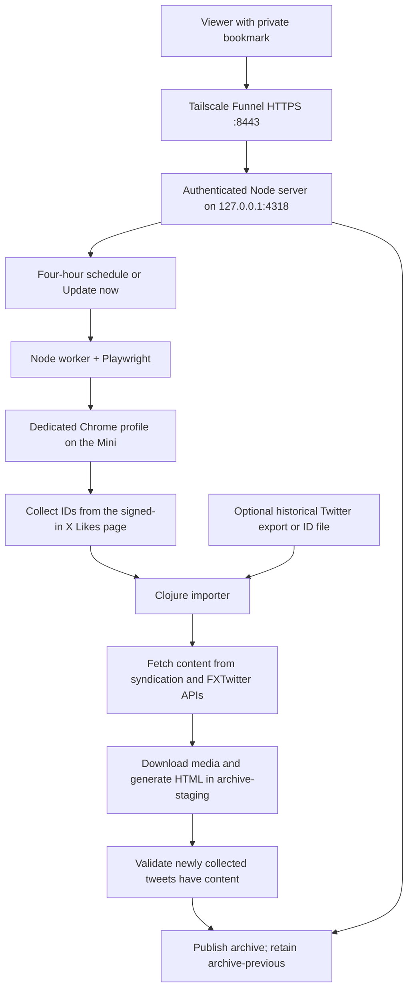

# Twitter Likes Archiver

A private Twitter/X likes archive running on a Mac Mini. A Node service schedules updates,
uses a dedicated Chrome session to collect new likes, and calls a Clojure importer to fetch
content, download media, and generate searchable HTML. No LLM or browser extension is required.

## Everyday use

Open your saved private bookmark, then choose **Browse archive** or **Update now**.
Automatic checks run approximately every four hours while the service is running. Search,
year/month/author filters, sorting, and light/dark themes are available in the archive.
Individual tweet and article pages include downloaded media; quoted photos, videos, and
GIFs appear inside quoted cards.

If X requires a new login, choose **Reconnect X**, sign into the dedicated Chrome window
on the Mini, then choose **Finish sign-in**. Automatic checks pause during sign-in. Your
ordinary Chrome windows can stay open. After a reboot, log into the Mini's macOS account
so the service can start.

See the [everyday guide](TUTORIAL.md) for browsing, backups, and recovery.

## Knowledge explorer

Choose **Explore knowledge** on the dashboard, or **Explore related** on any archived
tweet. This view adds:

- Stable links at `/knowledge/tweet/TWEET_ID`, with **Copy link** and **Copy Org link**.
  Org links use `[[https://YOUR-HOST/knowledge/tweet/123][description]]`. The host must
  remain stable for saved links to keep working. Links contain no access credential;
  a browser without a session is directed to unlock with its private bookmark and then
  returned to the requested tweet in the same tab.
- Search by meaning, including quoted text and article titles/previews. A query can
  match a related idea without sharing its exact words.
- A graph centered on a selected tweet and up to twelve semantic neighbors. Click a
  node to explore its neighborhood, use the related-ideas list or keyboard navigation,
  and pan/zoom or choose **Fit graph**. Edges represent model similarity, not citations.
- Suggested topic filters. These are approximate classifications from a fixed topic
  list, not manually curated categories or factual judgments.

The Mini runs a quantized MiniLM embedding model locally through Transformers.js. Model
weights are downloaded from Hugging Face on first use; tweet text and search queries
are not sent to an AI provider. The private vector cache and model files live under
`.service/`. The index checks for archive changes every minute, reuses unchanged vectors,
and replaces changed/deleted entries. Longer text is split into overlapping chunks.
During an initial build the explorer shows progress; later rebuilds keep the previous
index available until the replacement is ready. Failed builds retry automatically.

This first version indexes available text, quoted text, and article previews. It does not
perform image OCR, video transcription, or full-article text extraction. The model is
primarily suited to English. Similarity and topic assignments may be imperfect.

For a local feature-branch preview, run `node service/preview-knowledge.mjs` and open the
bookmark saved in `.service/knowledge-preview/private-link.txt`. This uses the local
archive and a separate semantic cache; it does not run scraping or modify the archive.

## Architecture



- **Node service:** serves the dashboard and protected archive, persists status, and checks
  every 30 seconds whether an update is due. Each attempt schedules the next check four
  hours after it finishes. Only one update or sign-in runs at a time.
- **Browser worker:** launches installed Google Chrome using a separate profile in
  `.service/browser`. Playwright connects to headless Chrome for collection; user sign-in
  happens in a normal visible Chrome window. The worker uses tweet timestamp links to
  collect parent IDs and tracks the order of likes, rather than comparing tweet creation IDs.
- **Clojure pipeline:** imports only new IDs, fetches text, articles, and quoted content,
  downloads media, persists metadata, and generates the index, JSON, and individual pages.
  Twitter's syndication response also provides a fallback for quoted media when the
  supplemental API cannot return it. These content APIs do not require an API key;
  collecting the user's Likes page requires the saved X login.
- **Publication:** normal updates use an APFS copy-on-write staging directory. Missing
  content for a newly collected ID blocks publication. After validation, directory renames
  publish the result and retain the previous archive for rollback. Startup can recover an
  interruption between those renames. Media download failures are not part of this content
  validation; unavailable media may retain a remote URL.
- **Storage:** plain files and an EDN metadata cache; there is no database or cloud scraper.
  The generated archive can also be opened locally without the Node server.

The first collection looks for overlap with the existing archive. Later runs seek the
saved like-order cutoff. This is incremental collection, not a guaranteed complete
historical backfill. If a run imports a valid batch but cannot reach its cutoff, it can
publish that batch while preserving the old cutoff and reporting that a retry is needed.
X login challenges, page changes, and unavailable source tweets can require intervention.

## Private remote access

The current Mini deployment uses **Tailscale Funnel on HTTPS port 8443**, forwarding to
the Node service on **127.0.0.1:4318**. Viewing devices do not need Tailscale installed.
Tailscale Serve is an alternative for deployments restricted to a tailnet.

The saved bookmark carries a random secret in its URL fragment. The dashboard exchanges
it for an HttpOnly, Secure, SameSite cookie and removes the fragment from the address bar.
The dashboard shell is publicly reachable; archive files, status, and control actions
require authentication. Anyone holding the private link can view the archive and operate
the dashboard. This is bearer-link access, not individual user accounts.

`PUBLIC_ORIGIN` must match the external HTTPS origin, including the port. Keep the archive
behind the authenticated server; do not publish its directory as an unprotected static site.
See [service operations](service/README.md#access) for access configuration and token rotation.

## Installation and runtime

The deployed service targets **macOS on Apple Silicon with APFS**. Its installer expects
Homebrew tools under `/opt/homebrew`:

- Node.js and npm for the service and its locked Playwright dependency.
- Installed Google Chrome for collection and interactive X login.
- Clojure CLI and Java 21 for the importer.
- Python 3 for generating the LaunchAgent and desktop bookmark during installation.
- Tailscale configured to proxy HTTPS to the local service.

Follow the [installation and operations guide](service/README.md) to configure the HTTPS
proxy and run `scripts/install-mini.sh` with the correct `PUBLIC_ORIGIN`. The installer
installs Node dependencies, runs checks, and registers the `local.twitter-archive` user
LaunchAgent. It starts at macOS login and restarts after a crash. The installer does not
configure Funnel or expose the archive by itself.

The Clojure CLI can also be used separately for export imports and maintenance. It remains
a required part of the automated service; removing the old extension does not remove it.

## Project and data layout

```text
service/
  server.mjs              HTTP authentication, protected files, APIs, scheduler
  worker.mjs              Chrome lifecycle, Likes collection, staged imports
  dashboard.html          Private-link login, status, update and sign-in controls
  *test.mjs               Service, browser, and deployment checks
scripts/
  install-mini.sh         macOS LaunchAgent and private bookmark installer
  backfill-quote.clj      Fetch media for existing quotes from older archives
  restore-syndication-quotes.clj  Recover quotes from saved Twitter responses
src/twitter_scraper/
  core.clj                CLI and import/archive/recovery pipelines
  parser.clj              Twitter export and retweet parsing
  fetcher.clj             Content APIs, quoted content, media downloads
  html.clj                Index, JSON, tweet and article page generation
  util.clj                Shared utilities
resources/templates/style.css
test/twitter_scraper/core_test.clj

archive/                  Published HTML, tweets.json, media/, articles/, tweets/
  .tweet-cache.edn         Cached metadata, text, and media references
archive-staging/          Temporary working copy for a normal update
archive-previous/         Previous published archive for rollback
.service/                 Private runtime state; excluded from Git
  access.json             Bearer credential
  private-link.txt        Complete private bookmark
  status.json             Schedule, like-order cutoff, and update/login status
  browser/                Dedicated Chrome profile and saved X session
  pending.txt             IDs passed to the importer
  service.log, error.log   LaunchAgent output
```

## Imports and maintenance

Daily updates require no terminal commands. Initial historical imports, optional retweets,
and recovery remain available through the CLI. Use a separate output directory for manual
work; do not run competing imports against the live service's archive.

```bash
# Initial historical import from an extracted Twitter export
clj -M -m twitter-scraper.core --input ~/twitter-archive --output ./archive-repair

# Add specific IDs or tweet URLs, one per line
clj -M -m twitter-scraper.core --import /path/to/tweet-ids.txt --output ./archive-repair

# Include retweets from the export (not collected by Likes automation)
clj -M -m twitter-scraper.core --input ~/twitter-archive --output ./archive-repair --include-retweets

# Retry cached entries missing tweet content
clj -M -m twitter-scraper.core --refetch-failed --output ./archive-repair

# Regenerate pages from an existing cache without network access
clj -M -m twitter-scraper.core --input ~/twitter-archive --output ./archive-repair --skip-fetch --skip-media

# Full CLI reference
clj -M -m twitter-scraper.core --help
```

For recovery, first prepare a copy of the existing archive at the chosen output path.
Verify that the live cache has not changed before publishing a repaired copy. The
[maintenance guide](TUTORIAL.md#maintenance-and-recovery) covers missing media, quoted-media
migrations, and retweet-only imports. Those migration scripts are not recurring tasks;
new imports include quoted media automatically.

## Backups

Back up the **entire `archive/` directory**, including the hidden `.tweet-cache.edn`,
`media/`, and `articles/`. The cache stores metadata, not image or video bytes. HTML and
JSON can be regenerated, but deleted source media may never be downloadable again.
`archive-previous` is a rollback copy, not an independent backup.

Back up service configuration and `.service/` state securely if you need to recover the
installation and its cutoff. These files include credentials and session data: keep them
out of Git and public assets. Restoring a Chrome profile may still require a new X login.

## Validation

```bash
clojure -M:test
npm ci --prefix service
npm test --prefix service
npm --prefix service run test:quotes
npm --prefix service run test:knowledge
```

These cover import/cache behavior, quote extraction and rendering, server access controls,
and quoted-image display in Chrome. See [service test documentation](service/README.md#tests)
for collection fixtures, login persistence, and checks against a running deployment.

## License

MIT
